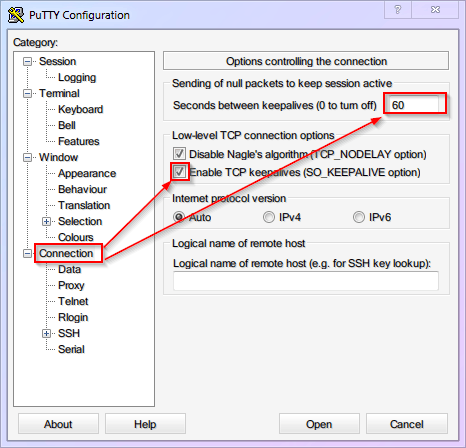
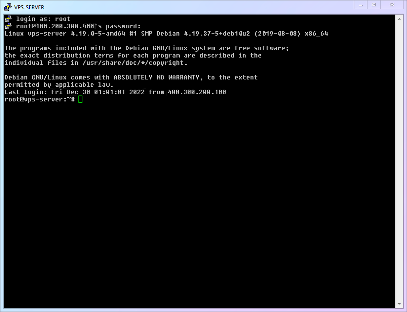

# 【Глава 3】 Удалённое подключение

## 3.1 Удалённое подключение к VPS (PuTTY)

Во-первых, поскольку Windows является самой распространённой операционной системой среди новичков, в этой статье мы будем использовать её в качестве примера.

Во-вторых, хотя PowerShell и WSL в Windows 10 и выше также предоставляют удобные инструменты для работы по SSH, не все версии Windows имеют эти компоненты. Поэтому в этой статье мы рассмотрим подключение по SSH с помощью старого доброго PuTTY. (После подключения по SSH действия во всех программах будут одинаковыми.)

Итак, давайте начнём.

1. Перейдите на [официальный сайт](https://www.chiark.greenend.org.uk/~sgtatham/putty/latest.html) PuTTY и скачайте версию, подходящую для вашей операционной системы (в этой статье мы будем использовать 64-битную версию).

   

2. Запустите PuTTY. Откроется главное окно программы. Теперь возьмите [блокнот](./ch02-preparation.md#21-получение-vps), в который вы записывали информацию в предыдущей главе, и введите **IP-адрес** и **порт** вашего VPS в соответствующие поля (на скриншоте ниже). Чтобы не вводить эти данные каждый раз, можно сохранить сеанс (Saved Sessions). В дальнейшем вы сможете загрузить сохранённые настройки одним кликом.

   

3. Рекомендуем установить значение `keepalive` в разделе `Connection` равным `60` секундам, чтобы предотвратить разрыв SSH-соединения, если вы долгое время не будете выполнять никаких действий. Не забудьте снова сохранить настройки.

   

::: warning Внимание
После любых изменений настроек PuTTY необходимо сохранить сеанс, иначе они будут потеряны при закрытии программы.
:::

4. Нажмите кнопку "Open", чтобы открыть окно SSH-подключения. Введите имя пользователя и пароль для подключения к вашему VPS (в этой статье предполагается, что имя пользователя по умолчанию — `root`. Обратите внимание, что при вводе пароля в Linux не отображаются символы `******`. Это сделано для того, чтобы скрыть длину пароля. Не пугайтесь, ваша клавиатура в порядке!).

   

## 3.2 Успешное подключение по SSH! Знакомство с командной строкой!

1. Если вы всё сделали правильно, вы увидите примерно такой экран, как на рисунке ниже. Это означает, что вы успешно подключились к серверу:

   

   Этот экран — аналог «рабочего стола» на удалённом сервере, но здесь нет привычных значков, курсора мыши и ярких цветов. Только текст. Это и есть **командная строка** — _Command Line Interface_ или сокращённо _CLI_.

   Все дальнейшие действия вам придётся выполнять в командной строке, как хакер в кино. Возможно, поначалу это покажется вам непривычным, но поверьте, в использовании командной строки нет ничего страшного или сложного. По сути, это всего лишь способ взаимодействия с компьютером с помощью текстовых команд вместо графического интерфейса. **Вы пишете команду, а компьютер её выполняет.**

2. Теперь можете немного осмотреться и познакомиться с командной строкой. На этом экране уже есть полезная информация, например, версия ядра системы (в данном случае `4.19.37-5`), время последнего входа в систему, IP-адрес и т.д. Конечно, в зависимости от VPS, ваш экран может выглядеть немного иначе.

3. Обратите внимание на последнюю строку командной строки. Слева от мигающего курсора находится набор символов. В данном случае это `root@vps-server:~#`. Что это значит? Всё просто:
   - Текущий пользователь: `root`.
   - Имя сервера, на котором работает пользователь `root`: `vps-server`.
   - Текущий каталог, в котором находится пользователь `root`: `~`.
   - Символ `#` указывает на то, что после него можно вводить команды.

   Первые два пункта интуитивно понятны и не требуют пояснений. Третий пункт относится к файловой системе Linux. Сейчас вам не нужно вдаваться в подробности, достаточно знать, что `~` — это «домашний каталог» текущего пользователя. Четвёртый пункт, символ `#`, также не требует особого внимания. Просто знайте, что в дальнейшем все команды, которые вам нужно будет вводить, будут начинаться с `#` или `$`. Это будет означать, что **после** этого символа нужно ввести команду (поэтому при копировании команд **копируйте только текст после**, без символа `#` или `$`).

## 3.3 Первое обновление программного обеспечения Linux!

1. Так же, как и ваш телефон, будь то Android или iPhone, Linux нуждается в регулярном обновлении программного обеспечения для получения исправлений безопасности и новых функций. В Linux каждое приложение называется «пакетом» (package). А программа, которая управляет пакетами, называется «менеджером пакетов» (Package Manager). С помощью менеджера пакетов можно устанавливать, обновлять и удалять программы, а также обновлять саму систему Linux. Менеджеры пакетов Linux очень мощные, но сейчас вам достаточно знать, что в Debian используется менеджер пакетов `apt`. Давайте обновим систему с помощью `apt`, чтобы вы познакомились с его основными функциями.

2. Базовые команды Linux:

   |  Номер   |    Команда    | Описание              |
   | :------: | :-----------: | :-------------------- |
   | `cmd-01` | `apt update`  | Проверить обновления  |
   | `cmd-02` | `apt upgrade` | Установить обновления |

3. Введите первую команду, чтобы получить информацию об обновлениях:

   ```shell
   apt update
   ```

4. Затем введите вторую команду. При появлении запроса на подтверждение установки `(Y/n)` введите `y` и нажмите Enter, чтобы начать установку.

   ```shell
   apt upgrade
   ```

5. Весь процесс показан на гифке ниже:

   

## 3.4 Ваш прогресс

**Поздравляем, вы сделали ещё один важный шаг!** Теперь вы умеете подключаться к своему серверу по SSH! Но что делать после подключения, кроме обновления системы? Узнаем в следующей главе!

> ⬛⬛⬛⬜⬜⬜⬜⬜ 37.5%
